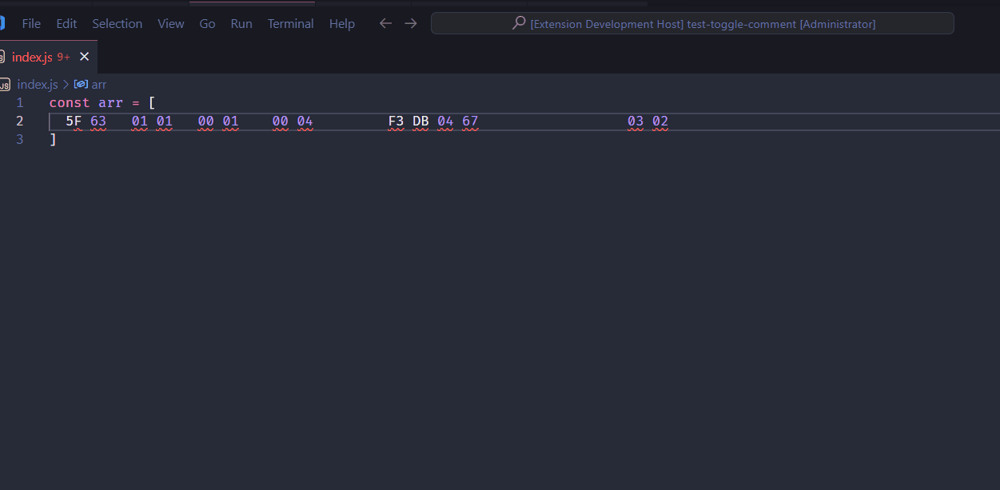

# vscode-awesome-hex

## Configurations

<!-- configs -->

| Key                                    | Description            | Type     | Default |
| -------------------------------------- | ---------------------- | -------- | ------- |
| `vscode-awesome-hex.separator`         | Hex Separator          | `string` | `", "`  |
| `vscode-awesome-hex.openingDelimiters` | Hex Opening Delimiters | `string` | `""`    |
| `vscode-awesome-hex.closingDelimiters` | Hex Closing Delimiters | `string` | `""`    |

<!-- configs -->

## Commands

<!-- commands -->

| Command                          | Title                            |
| -------------------------------- | -------------------------------- |
| `vscode-awesome-hex.prettierHex` | vscode-awesome-hex: Prettier Hex |

<!-- commands -->

## License

[MIT](./LICENSE.md) License © 2022 [kkopite](https://github.com/action-hong)
